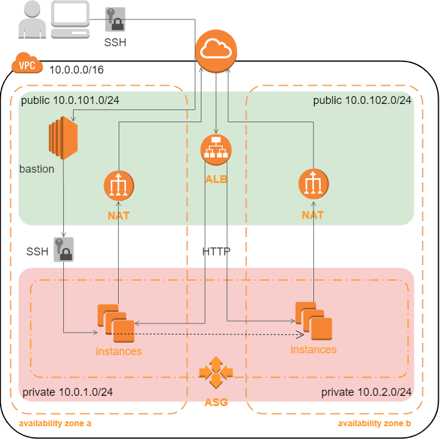
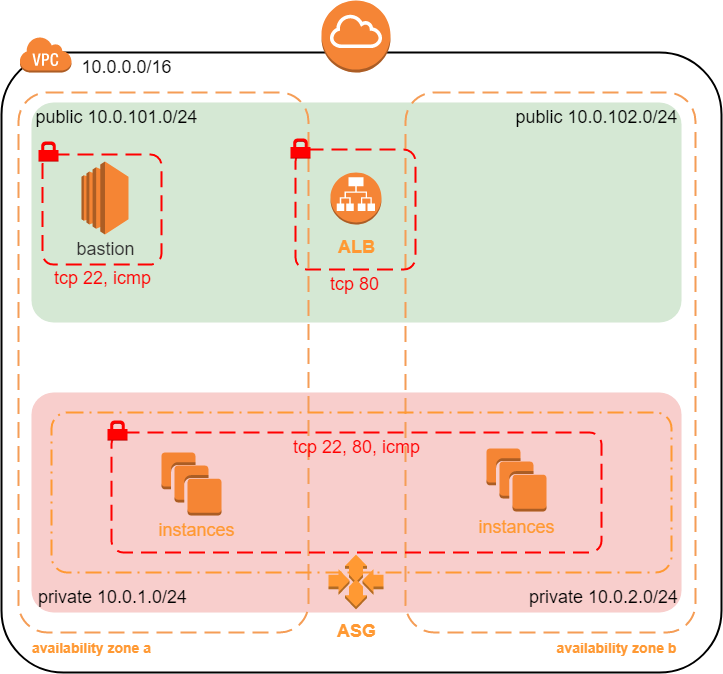

# It is a simple AWS VPC, built by Terraform.

### project contains:

- 2 public subnets
- 2 private subnets
- Internet getaway
- 2 NAT
- Application load balancer
- Autoscaling group
- Bastion host




### security group



### for run you need:

1 installed terraform and git

2 clone this repository
```
git clone <https://github.com/612284/Kh-071-01-DevOps-Demo-2.git>
```
3 enter your variables in the terraform.tfvars file
```
region               = "eu-central-1"
cidr                 = "10.0.0.0/16"
azs                  = ["eu-central-1a", "eu-central-1b"]
private_subnets      = ["10.0.1.0/24", "10.0.2.0/24"]
public_subnets       = ["10.0.101.0/24", "10.0.102.0/24"]
instance_type        = "t2.micro"
key_name_bastion     = "your_key_name"
sg_alb_ingress_ports = ["80"]
sg_asg_ingress_ports = ["22", "80"]
sg_bas_ingress_ports = ["22"]
```
4 to add AWS credentials for example create 2 files

~/.aws/credentials
```
[default]
aws_access_key_id = your_access_key_id
aws_secret_access_key = your_secret_access_key
```
~/.aws/config
```
[default]
region = your_aws_region
```
or run in terminal
```
export AWS_ACCESS_KEY_ID=your_access_key_id
export AWS_SECRET_ACCESS_KEY=your_secret_access_key
export AWS_REGION=your_aws_region
```

5 run Teppaform
```
terraform init
terraform plan
terraform apply
```


By the value specified in alb\_dns\_name we can check the work of the load balancer


By value specified in bastion\_public\_ip we can do ssh connect to bastion host.
And then we can connect to other instances in a private subnet


Resources created by terraform


